# Proyecto ETL (S3, Glue, Athena)

## Descripcion

En este proyecto se demuestra el uso de servicios de AWS como Athena, S3, Glue, IAM para la contruccion de un ETL, donde se alimentara el glue catalog por medio de datos contenidos en un bucket s3 y se realizara un job para ejecutar el proceso de extraccion, transformacion y carga.

## Arquitectura

## Desarrollo

### IAM: Crear rol

iniciando se crear un roll para que awsglue tenga todos los permisos de poder conectarse con s3

### S3: crear buckets origen y destino

Amazon Simple Storage Service (Amazon S3) es un servicio de almacenamiento de objetos ofrecido por Amazon Web Services (AWS). Se trata de un servicio altamente escalable, seguro y duradero que permite almacenar y recuperar cualquier cantidad de datos de cualquier tipo.

1. Crear Buckets de origen donde se cargaran los datos y el bucket de destino donde se almacenaran los datos transformados luego de realizar el etl amazon glue.

    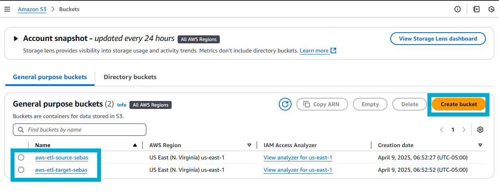

2. Cargar datos a bucket de entrada 

    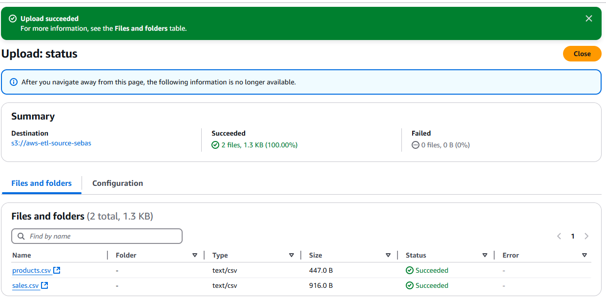

### AWS Glue

Amazon Glue es un servicio serverless de AWs que facillita la extraccion, transformacion y carga(ETL) de datos en entornos de Big Data.

Una vez cargados los datos en el bucket origen en S3 se creara un crawler para que explore la fuente de datos y alimente el glue catalog.

3. En el panel derecho nos vamos a la seccion de crawlers, luego seleccionamos la opcion crear un crawler.

    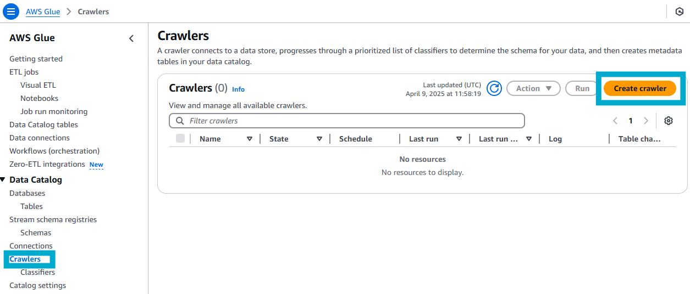

4. En las configuraciones para crear el crawler debemos definir donde esta la data origen, ahi vamos a seleccionar el bucket de origen de s3 y para la base de datos se creara una base de datos inicial y se seleccionara cada cuanto se va a ejecutar el crawler .

    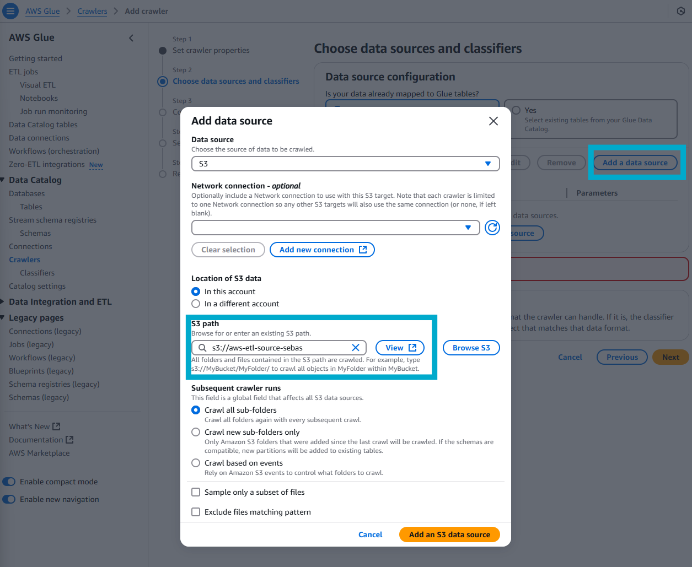

    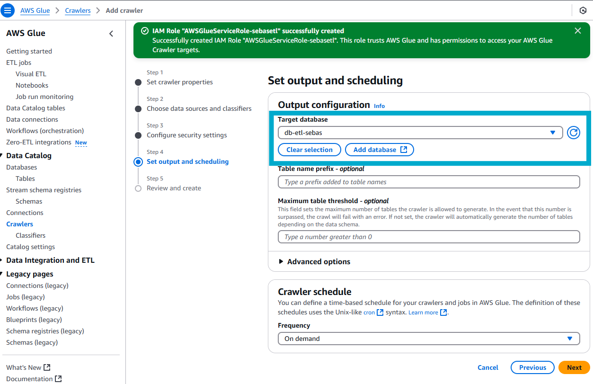

5. Una vez creado el crawler, lo haremos correr.

    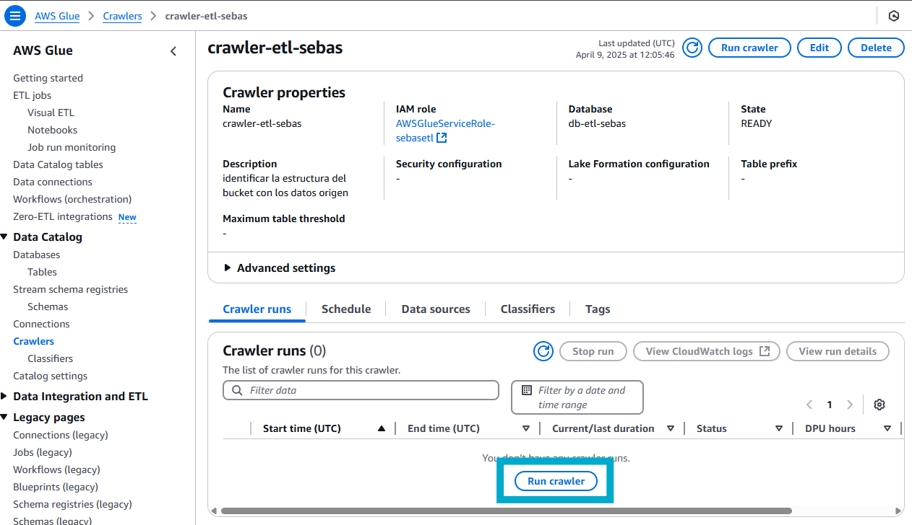

6. Cuando el crawler se haya terminado de ejecutar, nos dirigiremos en el menu derecho a la seccion Data catalog/ Databases y podremos ver que glue fue al bucket S3, exploro los archivos que habian y los trajo al glue catalog.

    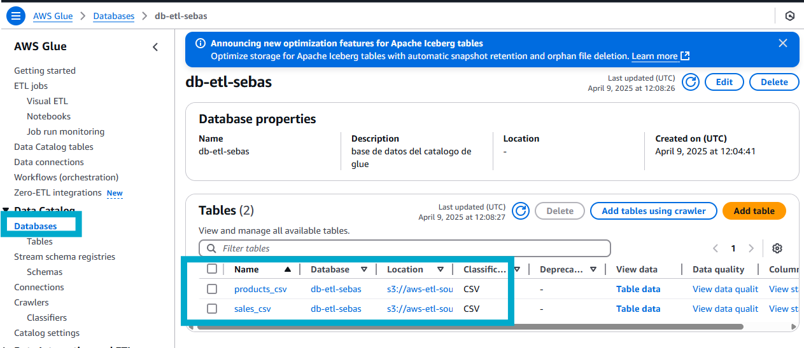

### AWS Athena

Amazon Athena es un servicio de consulta interactivo que permite analizar datos utilizando SQL estándar. No requiere servidores, ya que es completamente administrado por AWS y esta optimizado para grandes volúmenes de datos.

7. En el servicio de amazon athena en el menu de la derecha vamos a query editor y podemos ver que ya hay informacion sobre el data catalog, las base de datos que creamos en glue y las tablas contenidas en la base de datos.

    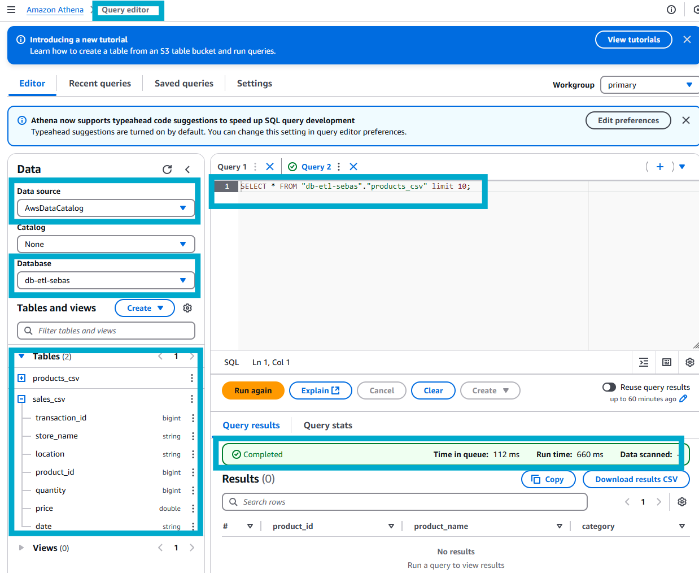

8. Volvemos al servicio de glue donde en el menu iremos a etl jobs, ahi definiremos la logica de nuestro etl contendio en el archivo.py y crearemos el job escogiendo la opcion **script editor**, selccionamos el motor y crear.

    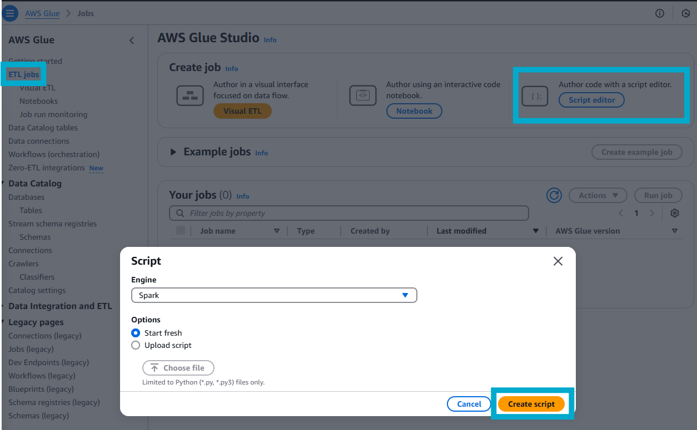

9. Copiaremos y pegaremos nuestro script de python, modificaremos el titulo y guardaremos el job.
    
    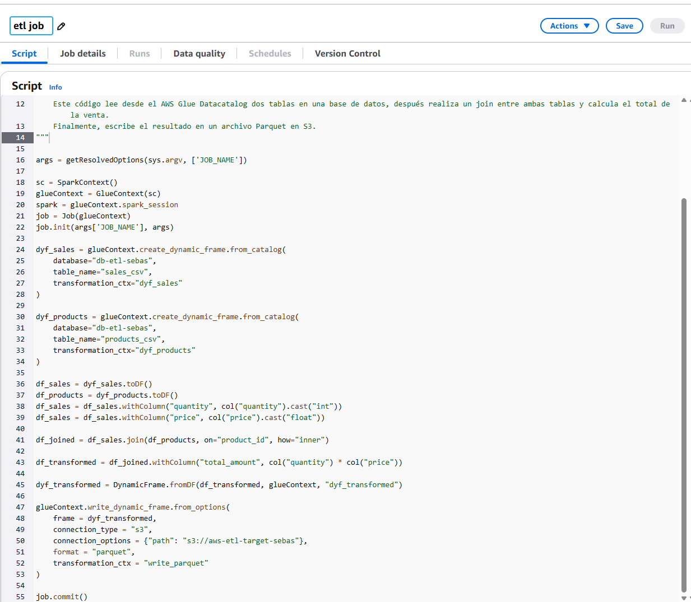 

    #### explicacion del script

    
10. Una vez creado, lo correremos y cuando este en un estado **succeded** volveremos a S3.

    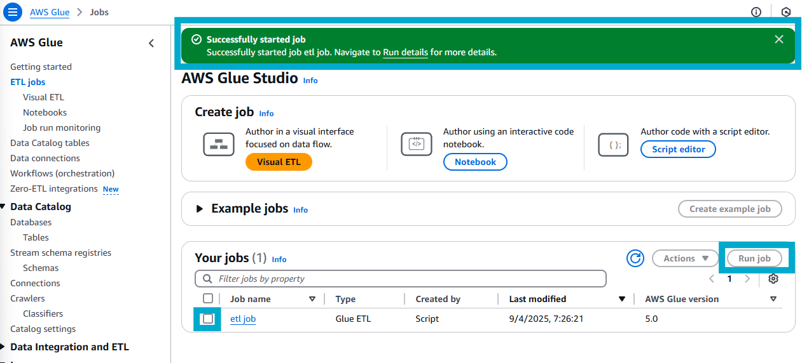 
    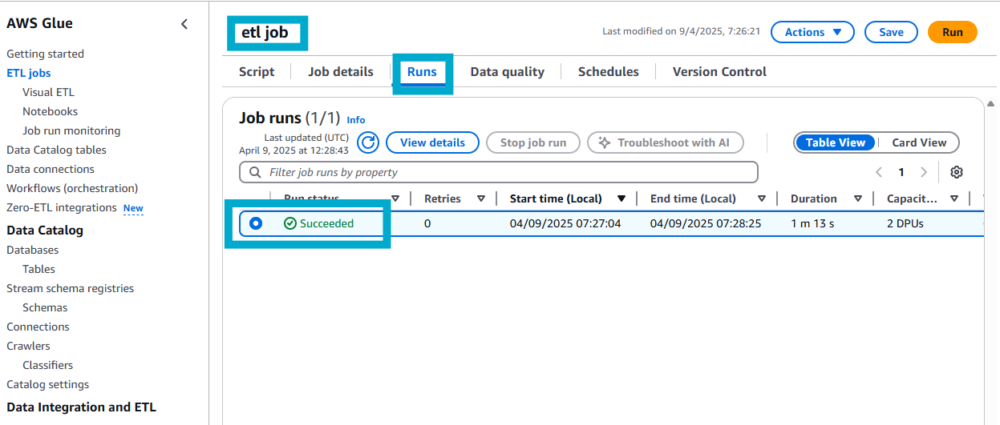 

11. Ya en S3, vamos al bucket destino y nos fijamos que ya esta nuestros datos transformados en el formato que se solicito.

    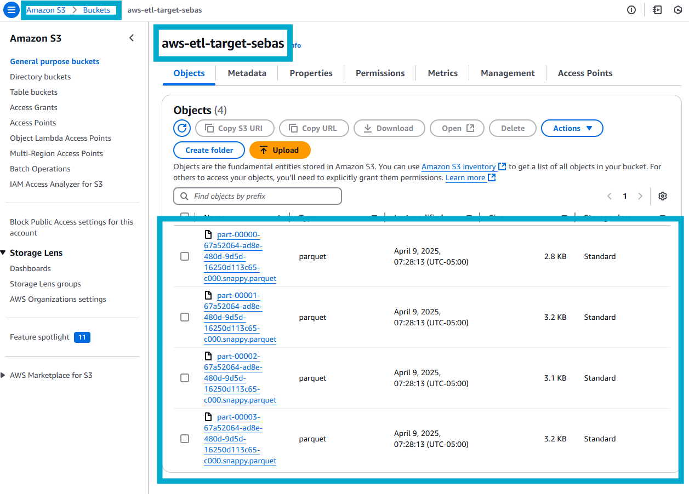 

12. Nuevamente en glue crearemos otro crawler para llevar la data transformada del bucket destino al glue catalog 

    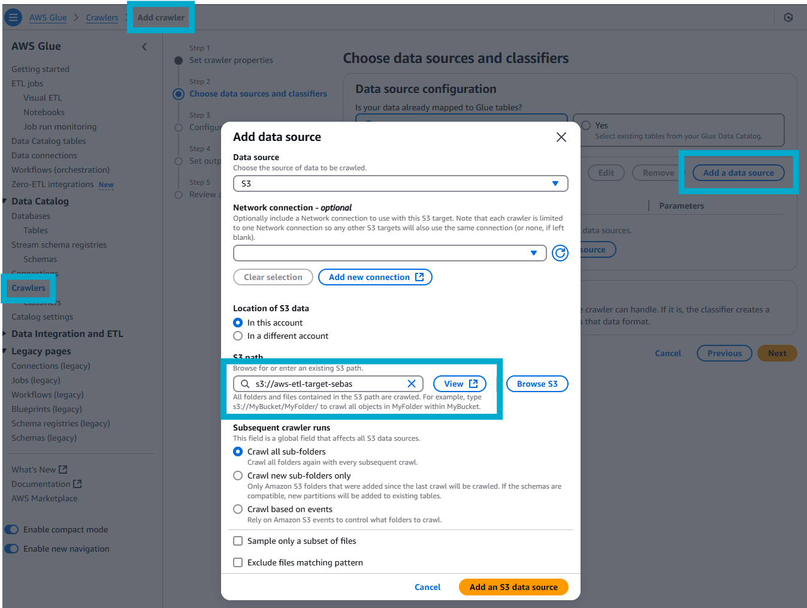 
    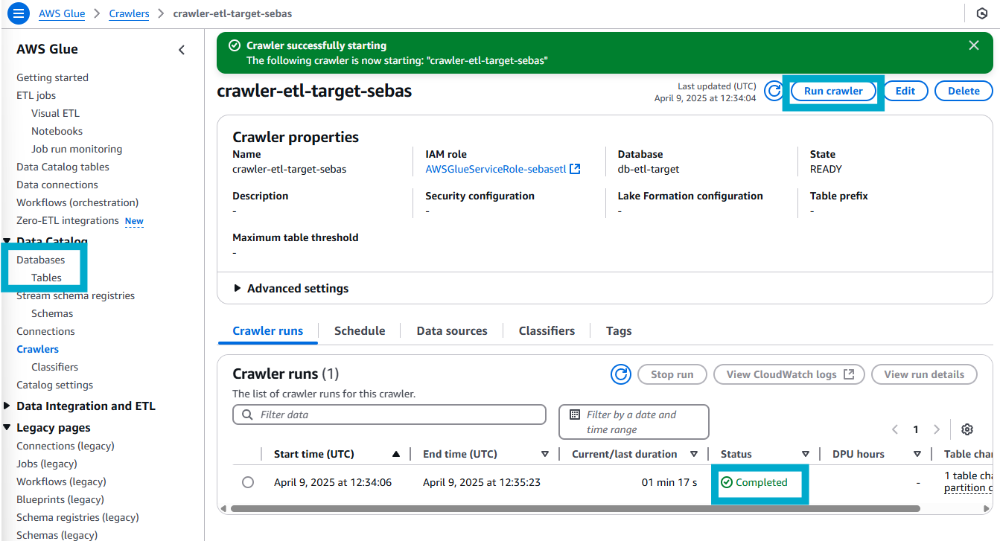 

13. Por ultimo iremos a athena nuevamente para explorar nuestra data transformada y verificarla.

    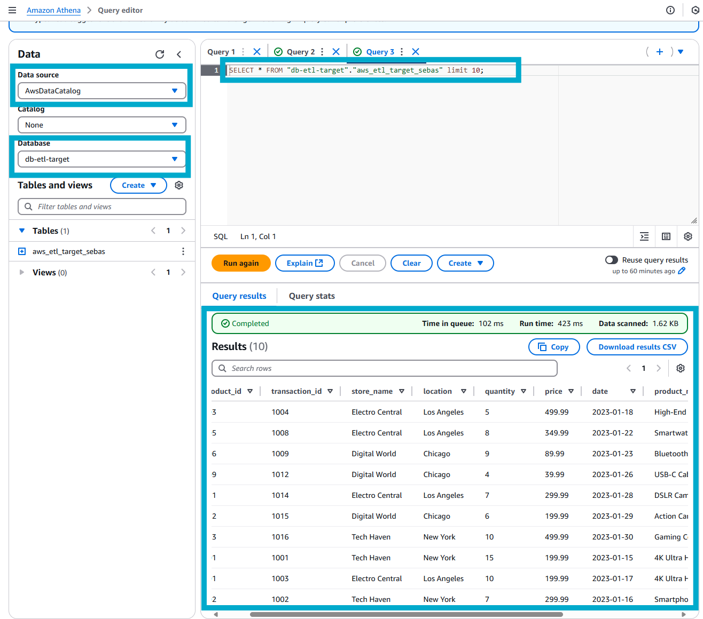

## Servicios Usados

* AWS IAM
* AWS S3
* AWS Glue Jobs, catalog, Crawler
* AWS Athena

